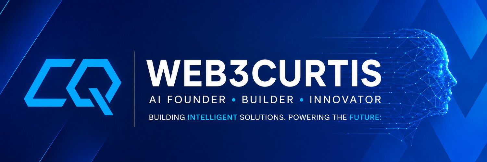

# Curtis Q

### Teenage builder exploring AI-agent architecture, reliability, and infrastructure.

---

## About Me

I'm a teenage builder and vibecoder fascinated by the possibilities of agentic AI.

To me, vibecoding represents a fundamental shift in who gets to build software. In the past, people without traditional programming experience could imagine useful tools and products, but bringing those ideas to life often remained out of reach. AI has lowered that barrier. A strong idea, curiosity, and the willingness to experiment can now become a working product.

My interest in AI agents began when I noticed how often people wished they could clone themselves to handle more work. Agents make a version of that possible: one person can coordinate a collection of specialised systems that research, reason, and act on their behalf. After using agents in my own work, I became increasingly interested in how they are designed—and in what happens beneath the final answer.

That curiosity led me to a more difficult question:

> **As agents become more capable and gain access to increasingly personal data, how do we know when their behaviour can be trusted?**

I created [**Critiqor**](https://github.com/web3curtis/Critiqor) to explore that question at runtime. Critiqor observes how agents behave, helps diagnose reliability risks, and turns execution evidence into practical improvements. My broader goal is to build infrastructure around agent architectures that makes agents more accurate, reliable, and understandable as we give them greater responsibility.

I build open-source tools at the edge of my understanding. Each project is both an attempt to solve a real problem and a public record of how quickly I can learn.

I want my work to show curiosity about what is happening in the world, the ambition to explore emerging technology deeply, and the discipline to turn ideas into useful tools for real people.

🌐 **Visit my website:** [web3curtis.vercel.app](https://web3curtis.vercel.app/)

---

## Selected Work

### Critiqor

**Runtime intelligence for AI agents.**

Critiqor helps developers observe agent execution, diagnose reliability risks, and improve agent behaviour using evidence from the runtime—not only the final response.

[View repository →](https://github.com/web3curtis/Critiqor) · [Explore Critiqor →](https://critiqor.vercel.app/)

### Critiqor × WebMCP

**An experiment in making agent–website interactions more inspectable and reliable.**

Built for the WebMCP Challenge, this project demonstrates how runtime evidence and authoritative state reconciliation can prevent duplicate effects after an agent loses a tool response.

[View Devpost submission →](https://devpost.com/software/critiqor-webmcp?ref_content=user-portfolio&ref_feature=in_progress) · [Try the live experiment →](https://critiqor-crema-reliability.terrence-qiu-7311.chatgpt.site/)

---

## Current Focus

- AI-agent architecture
- Runtime observability and evaluation
- Agent reliability and accuracy
- Human–agent collaboration
- Open-source developer infrastructure

---

## 🛠️ Tech Stack

---

## Find Me

[Website](https://web3curtis.vercel.app/) · [GitHub](https://github.com/web3curtis) · [X](https://x.com/web3curtis)
